<h1 align="center">Smart Manager</h1>
<p align="center">

 <figcaption align="center">The progressive web application built with Laravel and Vue.js</figcaption>
</p>


## Table of Contents
* [About Smart Manager](#about-smart-manager)
* [Tech Stack](#tech-stack)
* [Prerequisites](#prerequisites)
* [Development setup](#development-setup)
* [Features](#features)
* [Screenshots](#screenshots)
* [Database](#database)
* [API Documentation](#api-documentation)
* [Example users already existing in the database](#example-users-already-existing-in-the-database)


## About Smart Manager

The application allows you to manage an enterprise and its employees. The application features users with the roles of owner and employee. The application makes it easier for business owners to recruit new employees, allows them to manage their staff, and also supports the automation of financial processes in the business. In the application, a user with the role of employee can manage his data, as well as apply for jobs to various companies.

## Tech Stack
**Client**<br>

 

**Server**<br>


## Prerequisites
1. PHP 8.1.16 minimum
2. Composer 2.4.4 minimum
3. Node.js 18.12.1 minimum
4. MySQL 8.0 minimum

## Development setup

1. Prepare a new mysql database

2. Clone the project and open a new terminal window inside the root directory of cloned project

```bash
  git clone https://github.com/krzychu12350/smart-manager.git
```

3. Go to the project

```bash
  cd smart-manager
```

4. Go to backend directory

```bash
  cd backend
```

5. Install dependencies

```bash
  composer install
```

6. Copy the file '.env.example' and rename it to '.env', then configure it
to allow application connect with database and operate with a SMTP server allowing users to reset their passwords


7. Run migrations and seeders

```bash
  php artisan migrate --seed
```

8. Generate keys

```bash
  php artisan key:generate
```

```bash
  php artisan jwt:secret
```

9. Start the Laravel server

```bash
  php artisan serve
```

10. Open a new terminal tab/window and go to frontend directory

```bash
  cd frontend
```

11. Install dependencies

```bash
  npm install
```

12. Start the Vite server

```bash
  npm run dev
```

13. Open a browser and type in address bar

```bash
  http://localhost:5173/
```

## Features
### Owner role
- View statistics on the number of employees, complex applications, as well as the maximum and minimum salary of employees in the company
- Manage of a company' employees
- Generate a company' employees salary report in PDF
- Generate a employee's evaluation sheet in PDF format
- Manage the applications of the candidates for the company's employees 
- Search, filter and sort the list of employees and applications
- Manage your personal information  
- Manage your company's data
- Log in, register and reset your password

### Employee role
- Manage your personal information
- Filter and sort the list of submitted applications
- Search for companies
- Apply to companies
- Log in, register and reset your password

## Screenshots


<p>
    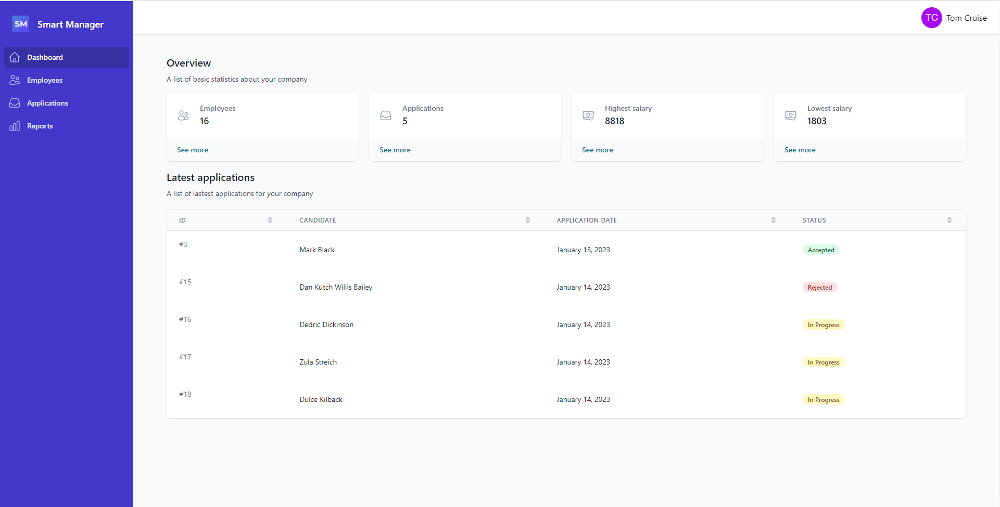
    <figcaption align="center">Owner dashboard view</figcaption>
</p>

<p>
    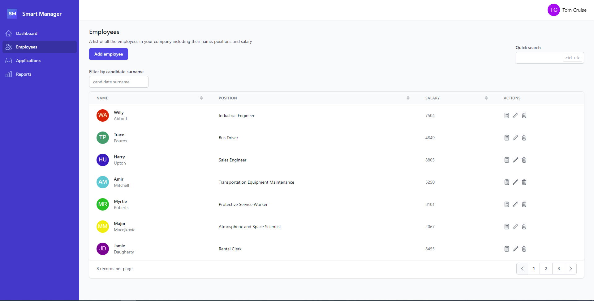
    <figcaption align="center">
      Employee management view of the company
    </figcaption>
</p>

<p>
    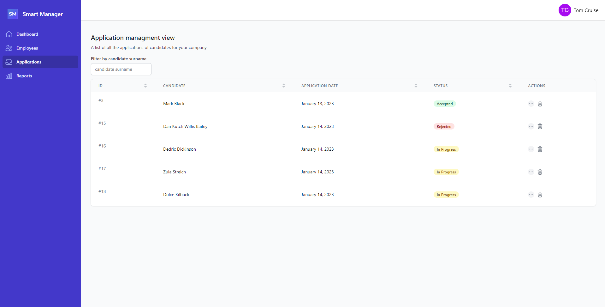
    <figcaption align="center">
      View of managing applications submitted to the company
    </figcaption>
</p>

<p>
    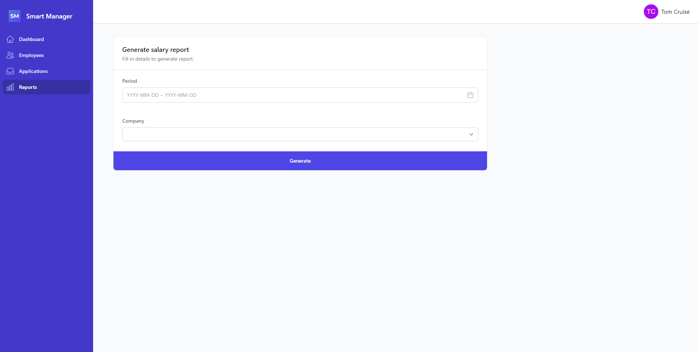
    <figcaption align="center">
      Salary report generation view
    </figcaption>
</p>

<p>
    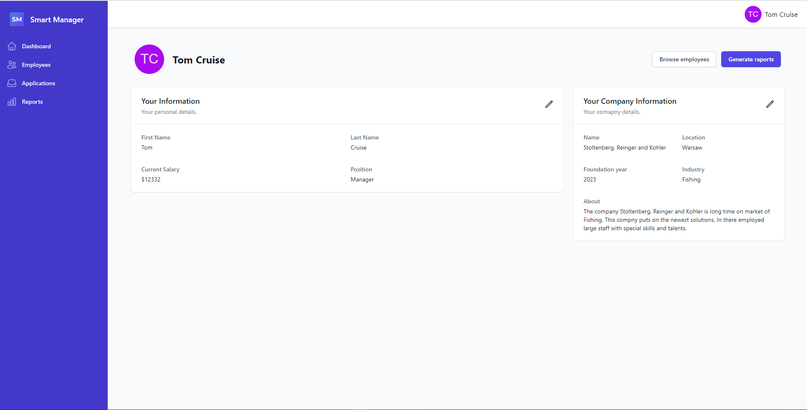
    <figcaption align="center">
      View of owner and company data management
    </figcaption>
</p>

<p>
    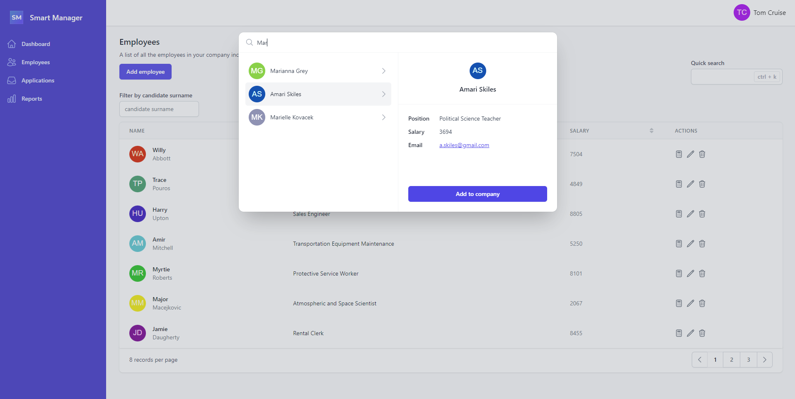
    <figcaption align="center">
      View of the search engine of candidates for employees
    </figcaption>
</p>

<p>
    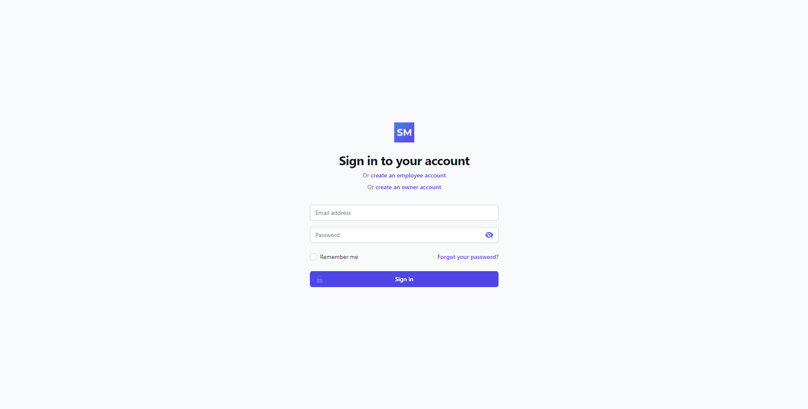
    <figcaption align="center">
      Login view
    </figcaption>
</p>

<p>
    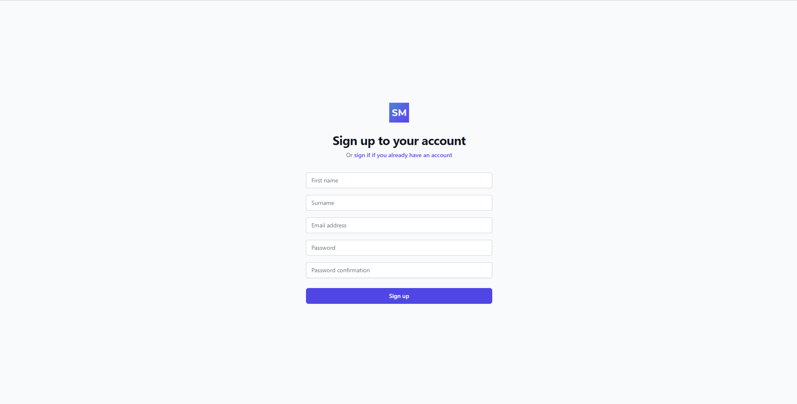
    <figcaption align="center">
      Registration view
    </figcaption>
</p>

<p>
    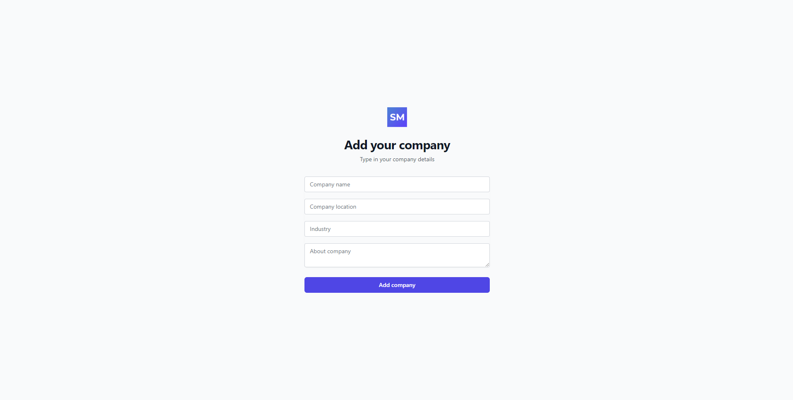
    <figcaption align="center">
      Company creation view
    </figcaption>
</p>

<p>
    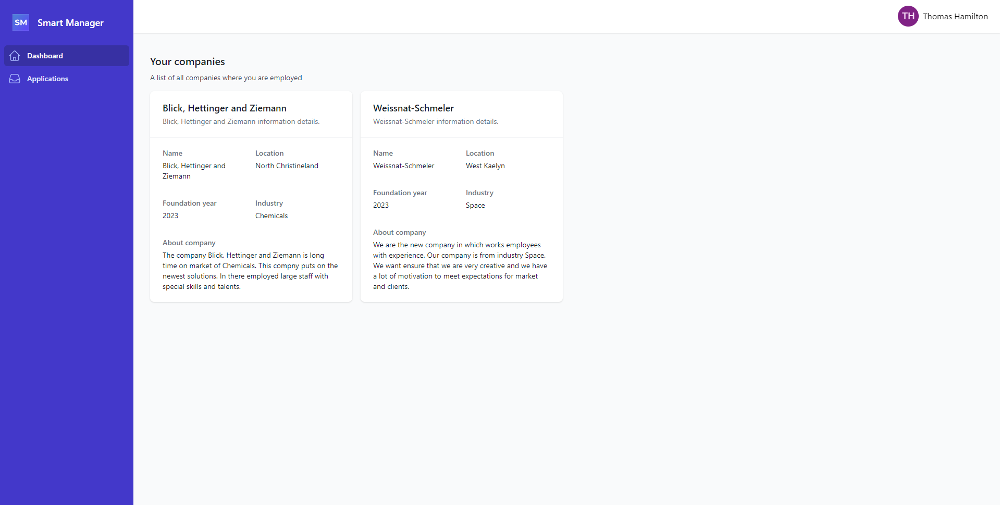
    <figcaption align="center">
      Employee dashboard view
    </figcaption>
</p>

<p>
    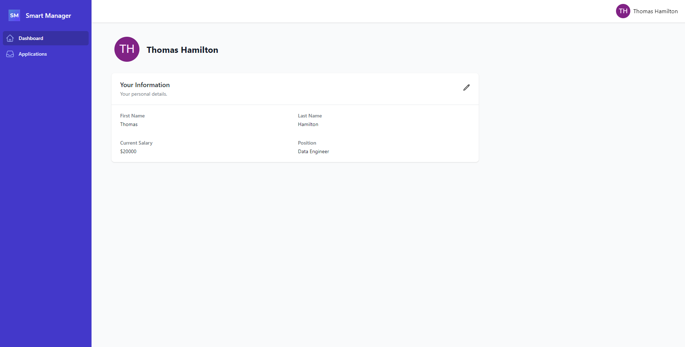
    <figcaption align="center">  
      Employee data management view
    </figcaption>
</p>

<p>
    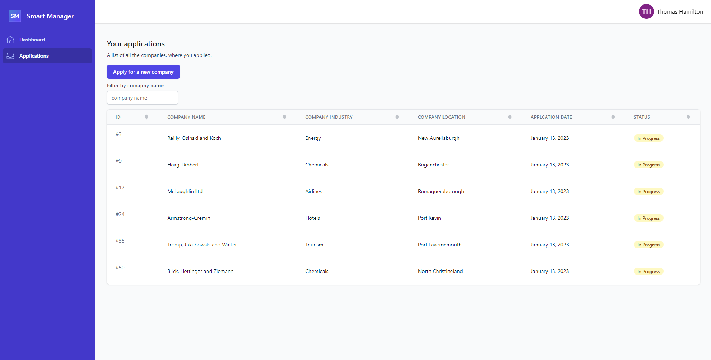
    <figcaption align="center">  
      View of submitted applications and adding submission of new job applications
    </figcaption>
</p>

<p>
    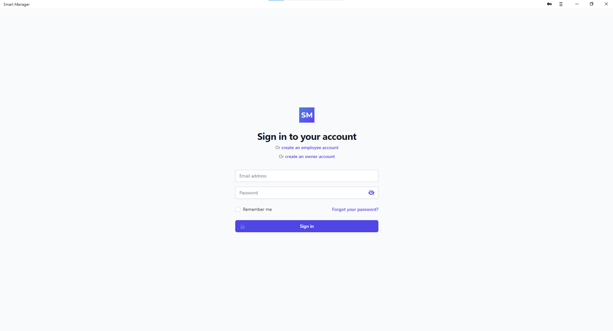
    <figcaption align="center">  
      Smart Manager running as PWA
    </figcaption>
</p>

## Database
### Entity Relationship Diagram

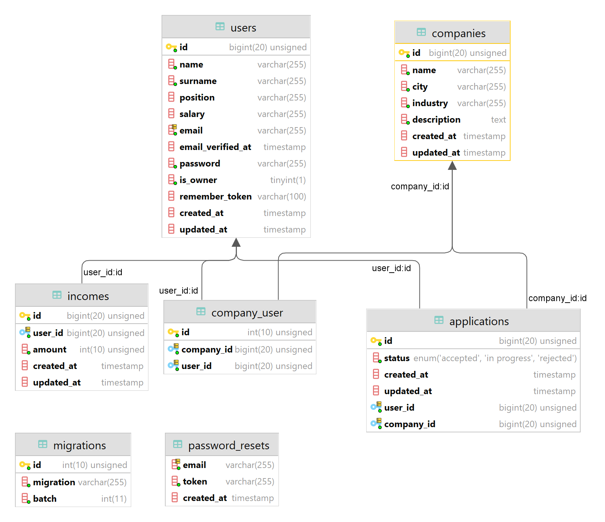

### Description of existing tables

1. Users table - store user data.

2. Companies table- store data of companies.

3.  Incomes table- store users' salaries along with the entire history of salary updates used to generate the report.

4. Company_user table- link companies to users.

5. Applications table- store data on non-owner user job applications to companies.

6. Migrations table- store information about migrations of tables sent to the database.

7. Password_resets table- store data that allows users to reset their passwords

## API Documentation

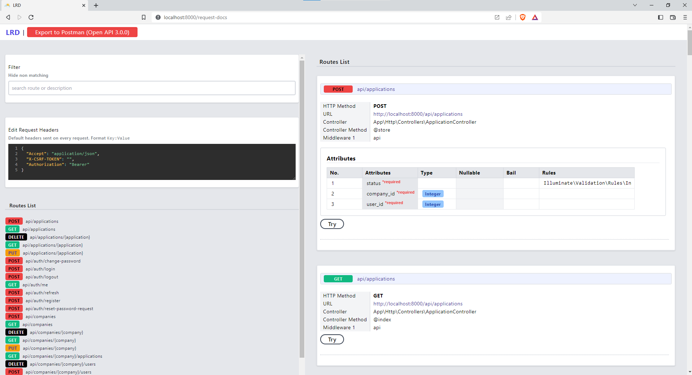

The API documentation was generated using the Laravel Request Docs tool.

https://github.com/rakutentech/laravel-request-docs

To run the documentation, start the Laravel server with the command ```php artisan serve``` and then visit ```http://localhost:8000/request-docs``` in your browser.

## Example users already existing in the database

### Owner role
Tom Cruise<br>
Email Address: ```t.cruise@gmail.com```<br>
Password: ```tCruise12?3```<br>

### Employee role
Mark Black<br>
Email Address: ```m.black@gmail.com```<br>
Password: ```mBlack12?3```<br>

## License
MIT
